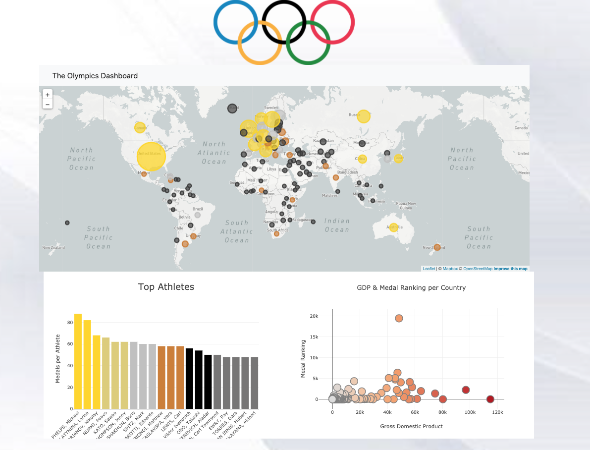

# Olympics Project
### Contributors
+ Angie Cruz
+ Yazmin Rodriguez
+ Juan Francisco Cambreros
+ Juan Jose Fernandez
+ Samantha Sepulveda

### Our topic
After a long time under lockdown, we have decided to “get out” of the pertaining subjects and seek a new trend arising, the Olympics. With over 11,500 athletes in attendance and hundreds of thousands of calls for cancellation. We believe this competition provides for interesting information to be looked for, measured, analyzed, cleaned, and conclusions to be made. We can look into athlete characteristics, sports, investment, finance and many more in order to create interactive mapping and charts, as well as tables. 

### Data Set
* [Olympics API](https://olympicsapi.docs.apiary.io/)
* [Country JS](https://country.js.org/)

### Inspiration Visualizations
| Olympics Dashboard |
| --- |

| Climate Dashboard |
| --- |

### Final Design 

This is our final visualization, which is interactive, feel free to check our map, our athletes, and our scatter plot, in which you can move your mouse to see countries, years, and more. 

### Class Presentation
* [Slides](https://docs.google.com/presentation/d/1cqn5UhNSXmkXvAfl1NeGoS3MglIUvNuQ/edit#slide=id.p2/)

### Conclusions 
As visualizaed in our data, GDP does present a high and positive relation in the amount of medals the country has. As expected, those countries with high GDP's such as USA and China hold a vast amount of medals. Like in most times when it comes to analyzing data, we do have outliers that break that rule, for example Qatar and Luxemburg have high GDP's and little to no medals.  Also, in our Top Athletes Dataframe, gender does play a role, since the majority of athletes with most medals are in fact men, nevertheless the second most medals, is a woman. 

